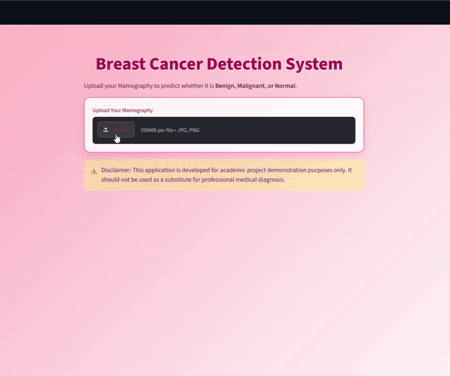

# Breast Cancer Image Classification & Deployment

An end-to-end deep-learning project for **breast cancer image classification**, with an interactive **Streamlit** application that allows a user to upload an image and receive a model prediction through a simple web interface.

## 🎥 Application Demo

The demo below shows the complete inference workflow — uploading an image, running it through the trained model, and displaying the prediction in Streamlit.



> **Portfolio highlight:** This repository demonstrates the complete workflow from image preprocessing and deep-learning inference to an interactive user-facing deployment.

## 📌 Project Overview

The objective of this project is to apply computer vision and deep learning to breast cancer image classification and make the trained model accessible through an easy-to-use web application.

The application provides a practical inference pipeline:

1. A user uploads a breast image through the Streamlit interface.
2. The uploaded image is prepared for model inference.
3. The trained CNN-based model processes the image.
4. The application displays the resulting prediction to the user.

## 🧠 Machine Learning Pipeline

```text
Breast Image
     ↓
Image Upload
     ↓
Preprocessing
     ↓
Trained Deep-Learning Model
     ↓
Model Inference
     ↓
Prediction
     ↓
Streamlit Result Interface
```

## ✨ Key Features

- Deep-learning-based image classification
- CNN-based computer-vision pipeline
- Automated image preprocessing for inference
- Interactive image upload through Streamlit
- Real-time model prediction through a web interface
- End-to-end deployment-oriented project structure
- Visual demonstration of the working application directly in this README

## 🖥️ Streamlit Application

The Streamlit interface converts the trained machine-learning model into an interactive application. Instead of running inference manually from a notebook or Python script, a user can upload an image and view the model output directly through the browser.

This demonstrates not only model development, but also the ability to turn a machine-learning workflow into a usable application.

## 🛠️ Tech Stack

| Area | Technology |
|---|---|
| Programming | Python |
| Deep Learning | CNN / Deep Learning |
| Computer Vision | Image preprocessing and classification |
| Web Application | Streamlit |
| Data Handling | NumPy / Pandas |
| Visualization | Matplotlib |
| Version Control | Git & GitHub |

## 🚀 Running the Project Locally

Clone the repository:

```bash
git clone https://github.com/rishikasinha00-beep/Breast_cancer_project_deployment.git
cd Breast_cancer_project_deployment
```

Create and activate a virtual environment, then install the dependencies used by the project.

If the repository contains a `requirements.txt` file:

```bash
pip install -r requirements.txt
```

Start the Streamlit application using the Streamlit entry-point file included in the repository, for example:

```bash
streamlit run app.py
```

> If your Streamlit entry-point has a different filename, replace `app.py` with that filename.

## 📊 Model Evaluation

Model performance should be interpreted using the evaluation metrics generated during training and testing. For medical-image classification, metrics such as **accuracy, precision, recall, F1-score, confusion matrix, and class-wise performance** are particularly useful when available.

The application is intended as a **portfolio and educational machine-learning project**. It is not a medical diagnostic system and should not be used for clinical decision-making.

## 📁 Repository Purpose

This repository demonstrates an end-to-end applied machine-learning workflow covering:

**Data → Image Processing → Deep Learning → Evaluation → Inference → Streamlit Deployment**

It was developed as a portfolio project to demonstrate practical skills in computer vision, deep learning, Python application development, and ML deployment.

## 🔮 Future Improvements

- Add confidence/probability visualization to predictions
- Expand model evaluation and comparison
- Add explainability methods such as Grad-CAM
- Improve deployment monitoring and error handling
- Add automated testing and CI/CD
- Improve the interface for mobile and smaller screens

## ⚠️ Disclaimer

This project is for **educational and portfolio purposes only**. The model output must not be interpreted as medical advice, diagnosis, or a replacement for evaluation by a qualified healthcare professional.

---

### Author

**Rishika**

GitHub: `rishikasinha00-beep`
